# Goodbye World! Report 

**Sung Lee u6677355, Lydia Huang u7298641, Rohan Khatwani u7298781, Emily Nguyen u7122524** 

## Table of Contents

1. [Introduction](#1-Introduction)

    1.1 [Overview](#1.1-|-Overview)
    
    1.2 [Team Members and Roles](#1.2-|-Team-Members-and-Roles)

    1.3 [Background and Motivation](#1.3-|-Background-and-Motivation)

2. [Methodology](#2-Methodology)

    2.1 [Application Objectives](#2.1-|-Application-Objectives)
    
    2.2 [How To Use the Application](#2.2-|-How-To-Use-the-Application)

    2.3 [Application Example Cases](#2.3-|-Application-Example-Cases)

    2.4 [Code Design](#2.4-|-Code-Design)
    
      - 2.4.1 [Data Structures](#2.4.1-Data-Structures)
      - 2.4.2 [Design Patterns](#2.4.2-Design-Patterns)
    
    2.5 [Grammar](#2.5-|-Grammar)

    2.6 [Tokenizer and Parser](#2.6-|-Tokenizer-and-Parser)

    2.7 [Application UML](#2.7-|-Application-UML)
    
    2.8 [Summary of Known Bugs](#2.8-|-Summary-of-Known-Bugs)

    2.9 [Testing Summary](#2.9-|-Testing-Summary)

    2.10 [Implemented Features](#2.10-|-Implemented-Features)

      - 2.10.1 [Basic App](#2.10.1-Basic-App)
      - 2.10.2 [Additional Features](#2.10.2-Additional-Features)
    
    2.11 [Surprise Item](#2.11-|-Surprise-Item)

    2.12 [Improvements](#2.12-|-Improvements)

3. [Teamwork](#3-Teamwork)

    3.1 [Summary of Individual Contributions](#3.1-|-Summary-of-Individual-Contributions)
    
    3.2 [Conflict Resolution Protocol](#3.2-|-Conflict-Resolution-Protocol)

    3.3 [Team Meetings](#3.3-|-Team-Meetings)

# 1 Introduction 

## 1.1 | Overview 

This report aims to provide a discussion, evaluation, and reflection of the functioning of the group, project decisions and implementations applied in the development of our application "Voluntutor". 

The following is a summary of the team members and their roles: 

## 1.2 | Team Members and Roles

| UID | Name | Role |
| :--- | :----: | ---: |
| u7298781 | Rohan Khatwani | General backend and search functionality |
| u7298641 | Lydia Huang | General frontend including chat functionality |
| u7122524 | Emily Nguyen | General frontend including login-signup and saved functionality|
| u6677355 | Sung Lee | Backend and frontend including profile functionality, data stream and firebase implementation |

The objective of this project was to create a functional application that provides some social benefits. 

We built "Voluntutor" in the Java programming language through Android Studio and implemented design patterns, data structures, and other concepts studied throughout the COMP2100 course. 

## 1.3 | Background and Motivation 

There exists a wide variety of social good applications in the market. Popular archetypes include applications that promote good health, provide well-being metrics, promote environmental sustainability, increase road safety, and more. 

When deciding what kind of application to create, our team unanimously shared the desire to implement an app that was unique to the popular ones just mentioned. We concluded that popular applications which provide a social benefit currently try to provide utility in a way that brings something new to the market. For instance, it is hard to determine the exact location of potholes if it was not for various applications that do this. Our approach was to consider what was a service that exists that is essential or very beneficial but currently predominantly for profit - not necessarily for social good and try to re-model the existing idea such that the for-profit aspect is less the focus. 

The decision/thought process for our idea can be summarised as follows:

1. What social causes are we passionate about? 
2. What services/applications currently exist which contribute to this social cause? 
3. Can we improve accessibility to this service/ is this service adequate to actually address the social cause? 
4. Can our idea be implemented through an application without "brute forcing" the idea? ie will an application assist in delivering our chosen social good rather than hinder it? 
5. Is the implementation scope realistic? 

We reached the consensus that as students, we are passionate about education. We also acknowledged our immense socioeconomic privilege and decided that increasing the accessibility to education is a social cause we would like to address. Specifically, we wanted to address the unfair access that students of a higher socioeconomic background have in being able to afford a private tutor for their school/coursework. 

There was a clear absence of this kind of service, and though a service that provides access to rural students was found, tutoring seemed to be an industry that was quite expensive and blatantly for-profit. 

We thus created an application that acts as a "tutor finder", where tutors either cost $0 or significantly cost less than the market value.

# 2. Methodology 

Although our intention of the social good our application provides, in theory, is clear, we acknowledge that the execution of our idea would at the very minimum require a functional application. Thus for the rest of the report, we will place a focus on explaining the technical aspects of our applications such as the implementation methods, data structures, design patterns, etc. We however will continue to refer back to the mission of our application where appropriate. 

## 2.1 | Application Objectives 

- Provide a social good as described in section 1.2. 
-  Have a functional user interface including:
   - User login with Firebase integration for data storage 
   - Editable user profile 
   - Homepage 
 - Create a partition between student users and tutor users:
   - Students and Tutors should have different profiles 
 - Include a functional search: 
   - Only students should be able to search for tutors
   - Search results should redirect to the tutor's profile 
 - Implement a functional peer-to-peer messaging feature 
   - Only students can message tutors 
   - Messages should be stored on firebase such that the chat history appears. 
 - Implement an activity status that shows relevant views such as profile, messaging, etc. 

Note that the points above provide a broad summary and should be implemented through the use of appropriate data structures, design patterns, and other concepts studied in COMP2100. We discuss the use of such concepts and discuss the implemented features in great detail in the sections below. 

### 2.2 | How To Use the Application
To use the app you have to log in to your own account or register (refer to figure 1 and 2.)  Once the user has logged/signed in a short 3 second loading screen will be displayed (refer to figure 3.) 

After the loading screen finishes the user is taken to the main home page. At the bottom of the activity a navigation bar is displayed and a search bar at the top. Within the search bar users can search for tutors by name, price and courses (refer to figure 4 and 5.

When searching for tutors if users forget a course name or misspell a name the search will show all items containing the string you have searched for (refer to figure 6,7 and 8.) 

Once a user searches for a tutor, they are able to click the name and the tutor profile will appear, here is an example with tutor Harrison (refer to figure 9.) After Harrisons name is clicked his profile is displayed with the relevant information. There the user is able to save the tutor with the saved button.  

Students are also able to contact tutors. In the chat activity users are displayed a list of tutors. After a tutor is selected the student can then chat with them and from then they are able to discuss tutoring sessions or whatever the user is seeking for (refer to figure 11 and 12.) 
 
Users can also view and edit their profiles. When viewing users bio, courses and price. The values will then be edited as users edit their information (refer to image 13 and 14.)

Figure 1: log in page 

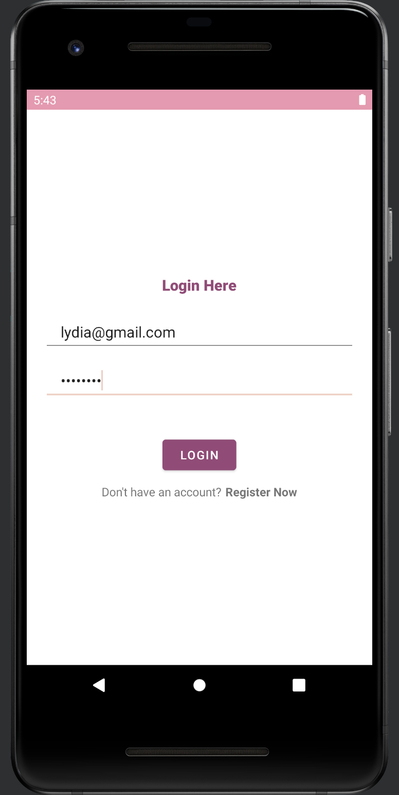	

Figure 2: sign up page	

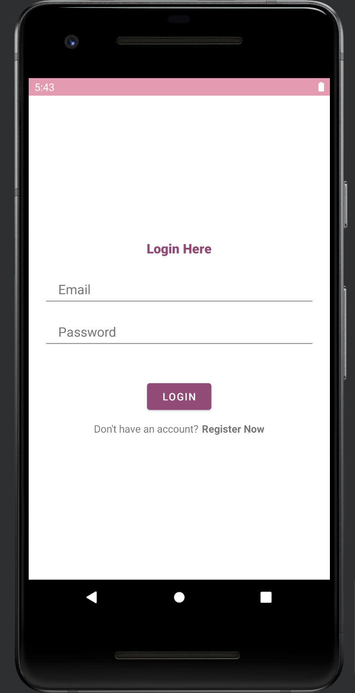		

Figure 3: loading 

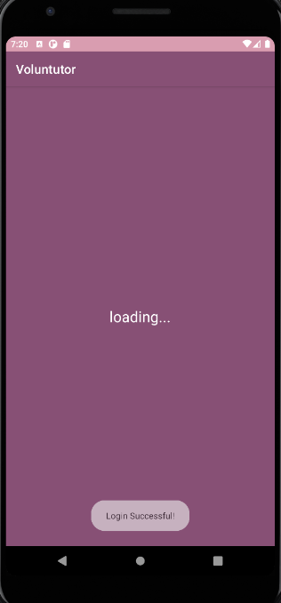	

Figure 4: search bar

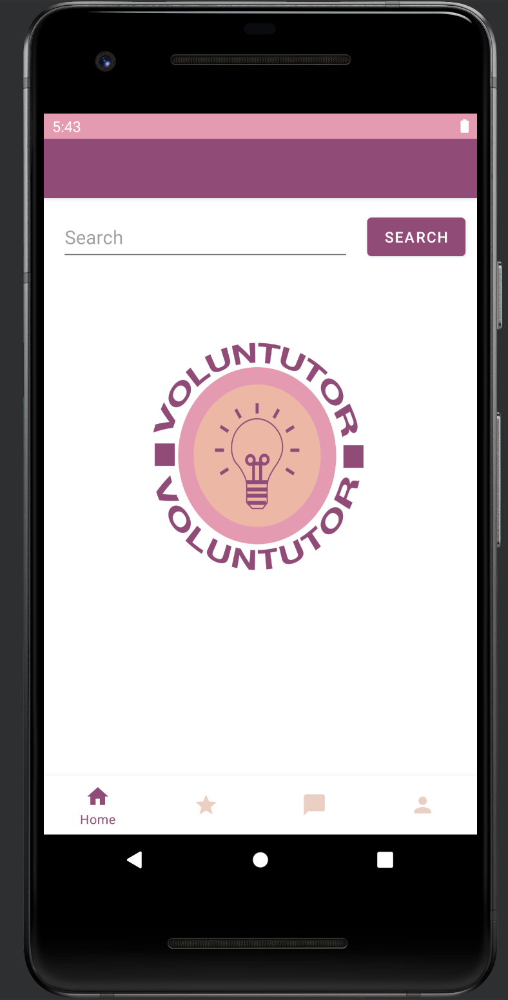		

Figure 5: input search

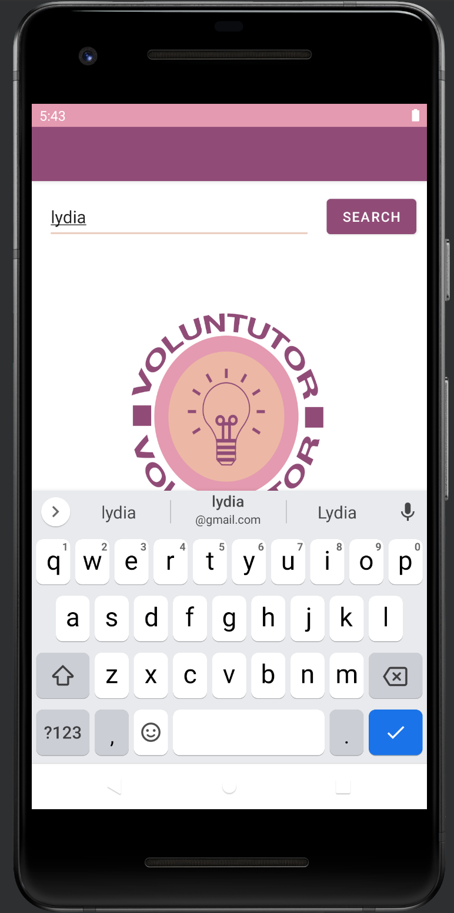	

Figure 6: search via name

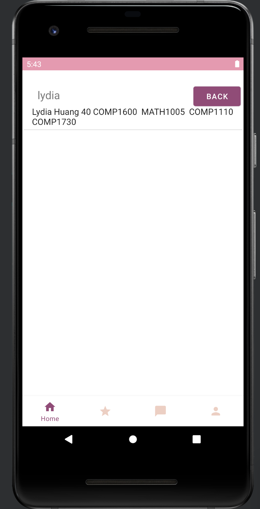	

Figure 7: search via course 

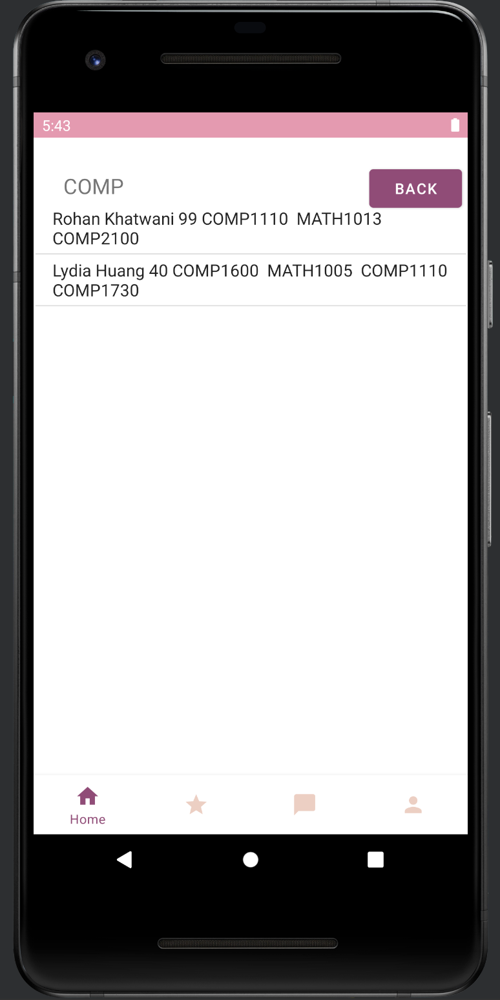	 

Figure 8: search via price

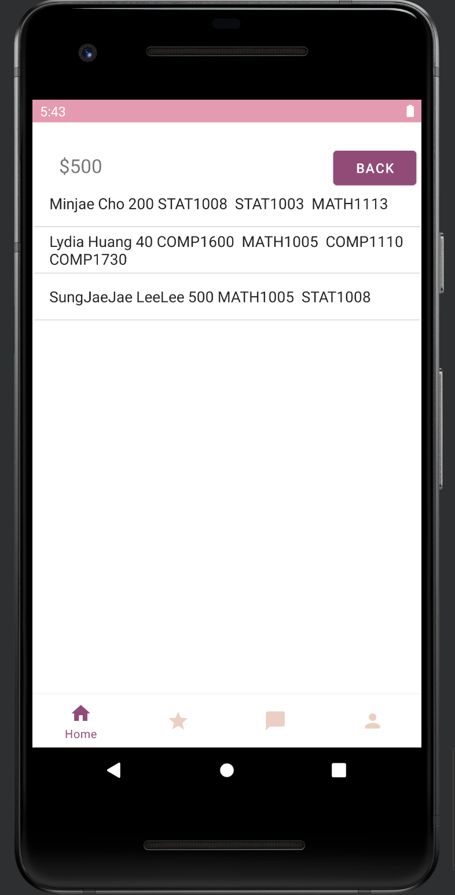	

Figure 9: search Harrison profile	

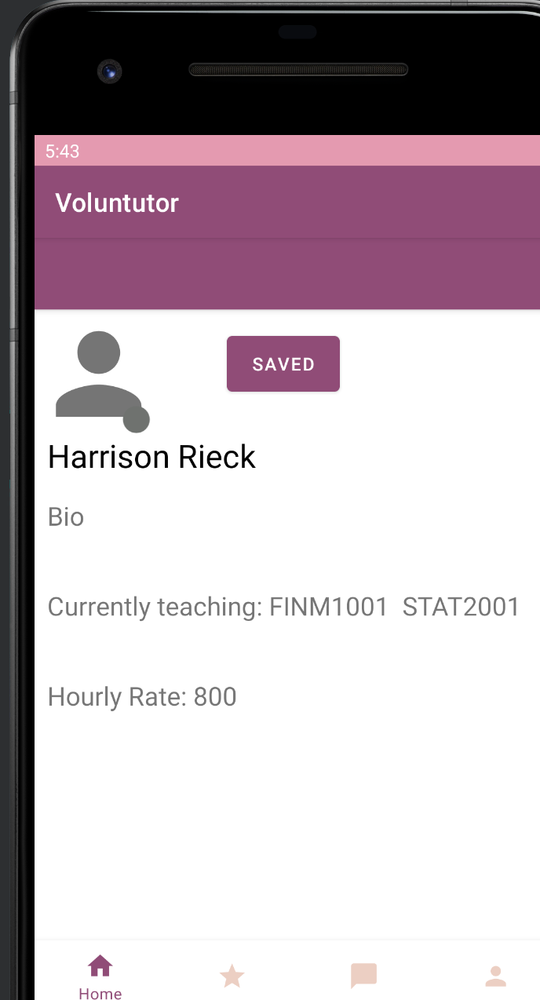	

Figure 10: saved activity

Figure 11: search via price

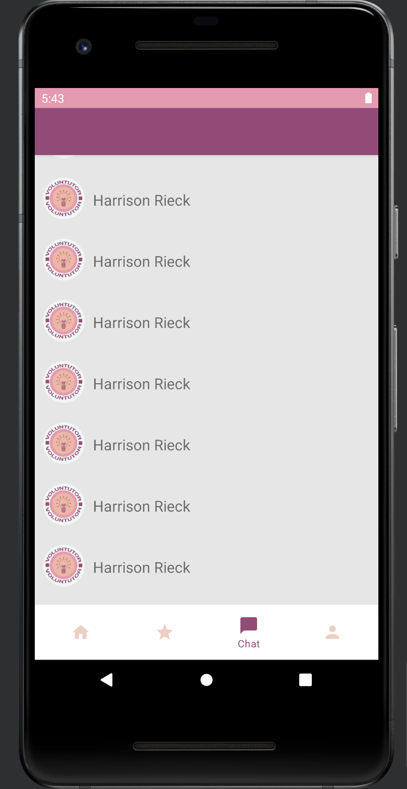

Figure 12: search Harrison profile	

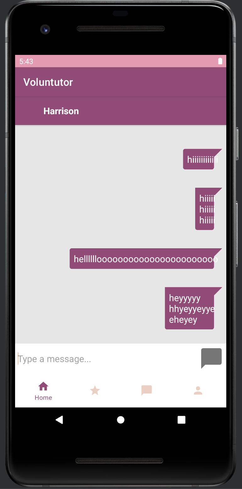

Figure 13: saved activity

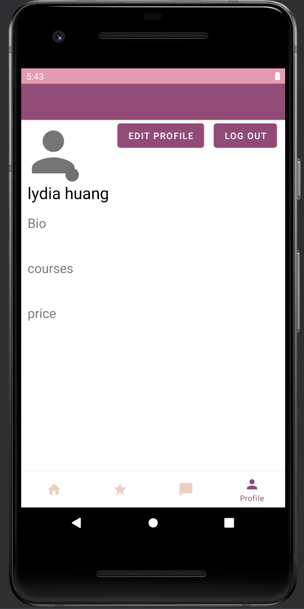	

## 2.3 | Application Example Cases
### Case 1: Lydia is looking for a tutor for STAT2001 (messaging and searching)

As Lydia is already a user she can just log in to the app without having to create a new user. Once logged in the search bar is displayed on the main home screen. Tapping on the search bar will allow her to search in the course she is looking for, STAT2001. After she types it in and presses search a new activity is displayed with the search results. From there she can choose a tutor that offers STAT2001 that she is interested in. There it will take her to the tutor's profile page then she can go to the message tad and message the chosen tutor, Harrison Rieck. There Lydia can contact Harrison and arrange a working tutor schedule for both of them. 
 
### Case 2: John is a new user and wants to search for a well-known tutor Rohan Khatwani (search by course and sign up) 

As John has never used ‘Voluntutor’ before he has to create a new account by selecting sign up. On the signup page, John is asked to fill in his first name, last name, email, courses, and password. As John is a student he can ignore the tutor check box and the price. After John clicks to sign up he is a registered user. Immediately John goes to the search box to search for the infamous tutor Rohan Khatwani. Although once John sees the price of $99 he feels as though he needs a cheaper tutor that is within his price range of $40. Therefore John can search for the price of $40 and all tutors with the price of $40 will be shown. John finds that tutor Lydia is a better fit for his budget and goes to contact her for more information. 

## 2.4 | Code Design
### 2.4.1 Data Structures
We used the following data structures in our project:
1. **AVL Tree** 
    This is implemented such that each node has a value and an ArrayList. The value parameter is the main value that is used for insertion and comparison between nodes, The ArrayList holds additional information related to the value. We implemented a generic type T AVL tree due to its ability to provide flexible and expansive applications.  In practice, string representations of the data were used for the node value and Arraylist. 
 
    **Objective:** Used for storing tutor names (value) or course names (value) with ArrayList holding information about the tutor. In both cases, the ArrayList contains the tutor name, hourly fee, and all courses taught by that tutor. Another instance of the AVL Tree is used to store the hourly rate for the tutor as the value and the same tutor information as above in the ArrayList. 

    **Locations:** Class created in BackEnd package, used in `SearchResults.java` lines 86-99 for returning the ArrayList(s) belonging to the node(s) which are relevant to the query.

    **Reasons:**It is more efficient than a binary search tree in the worst case scenario (due to self-balancing property)Assignment specifications requires the mandatory implementation of a tree data structure
We knew we needed a self-balancing tree for reducing time complexity with search, and we chose AVL Tree over a Red-Black Tree because it is easier to implement a ‘delete’ method for an AVL Tree compared to Red-Black Tree.
This was useful because one of the extra features was to implement a delete method for deleting a user if they decided to delete their account. Unfortunately, we did not have the time to implement this, however, we had planned to do so. 
 
2. **ArrayList**

    **Objective:** Used as a simple, dynamic data structure; heavily used in the assignment. 
For example, an ArrayList is the type of one of the parameters in our AVL Tree implementation. It stores extra information such as the tutor’s details. 
Used to display items in a recycler view. 

    **Locations:** 
SavedAdapter, TutorAdapter and MessageAdapter implements arrayLists which the MainSavedActivity, MainChatActivity and ChatMessenger uses.
**Reasons:** 
In the case of the recycler view, it would not make sense to use a tree as we want a “linear” structure to display a list of items. 
It is easier and more flexible than creating a class. 
 
 
3. **Hashmap**
 
    **Objective:** The Hashmap conveniently mirrors the key/value structure of our firebase. It is used as the data structure which stores information to be appended into firebase. 
Created from method generateFields (ie a user’s, id, first name, last name, user type, etc) found in both the Student and Tutor classes, as they extend the UserMethod 

    **Locations:**
    - `AVLTree.java` 
    - `Tutor.java`
    - `UserMethod.java`
    - `EditProfile.java`
    - `SearchResults.java`

    **Reasons:** 
Requires fewer lines of code to add user fields into firebase. As there is no requirement to traverse the whole firebase and search for a specific node. For example, we set the key as firstName and the value as the string of the name and we can easily append this into the firebase.
You can do it all in one line after you have the hashMap! 
This is particularly useful since: 
Less prone to human errors (e.g. in naming the node which will have consequences for other classes that wanted to find or use the value in that node.)
Increase abstraction of code (relying on methods rather than hard-coding the process). This also helps the debugging process incase of errors. 

### 2.4.2 Design Patterns
1. Factory Design Pattern 
    We have “`User.class`” to be our abstract class for creating an object. The subclasses “`Tutor.class`” and “`Student.class`” determine which type of User is instantiated, which implements the `UserMethod.class` interface. 
    `UserFactory.class` contains our creation method which will instantiate the User object. 

2. Adapter Design Pattern
    We extend the Message Adapter. 
We have two incompatible objects; we have an array list which we must display the contents of in a view. 
For instance, our `MessageAdapter.class` converts an array list of messages into a view. 

3. Facade Design pattern:
We used this design pattern on multiple occasions, but one main occurrence was from the generatefields() method in the Tutor/Student classes to generate the relevant fields for the user in firebase upon signup. 
This design pattern was used to improve the abstraction of code by creating a simplified interface that performs many actions behind the scenes. For example, the generate fields method creates a hashmap with all the relevant information from the user and is called in SignupActivity to populate the firebase with that information. 

## 2.5 | Grammar
An expression is evaluated as to whether it is an integer or a string. Based on this, it returns either the string expression or the int expression. 
 
Production rules

` <exp> ::= <input>
 <input> ::= <unsigned integer> | <string>`
 
**Advantages/Disadvantages of grammar**

Advantages:
Simple, efficient grammar that works for all use cases for this app (only possible searches are string name search or integer fee search)

Disadvantage: No inherent workaround for multiple word queries, although a backup plan:
Search results for each word, and take the intersection of all results to get the result for a long worded query. 
Allow for certain exceptions, i.e. no intersection when one or more words in the query have 0 results (this is so that there is at least some search results - ‘partial query’). This is essentially the current implementation (which is why partial query works), but does not take into account extra words

## 2.6 | Tokenizer and Parser
**General process:**

- The search string, obtained as a string variable from the search box, is put into the tokenizer. 
  - This gets converted to a token and the tokenizer decides if it is an INT token or a STRING token.
  - This token is put into the parser. 
    - The parser will parse the input token and return a string value of what it was.
  - This string is put into the ‘myFind()’ method which is called on the data structure (AVLTree) that is containing the relevant information from the database. myFind() will search this tree and return the relevant nodes containing the search query.
- Note that the token type (int or string) is used to determine which data structure (i.e. which instance of the AVL Tree) is used to check for the search query. 
  - For E.g. if the token is type INT then check the feeTree, otherwise, if it is type STRING then check the nameTree

## 2.7 | Application UML
The UML design describes a simple walk-through of how the app works and what classes are called in order to run the app. 

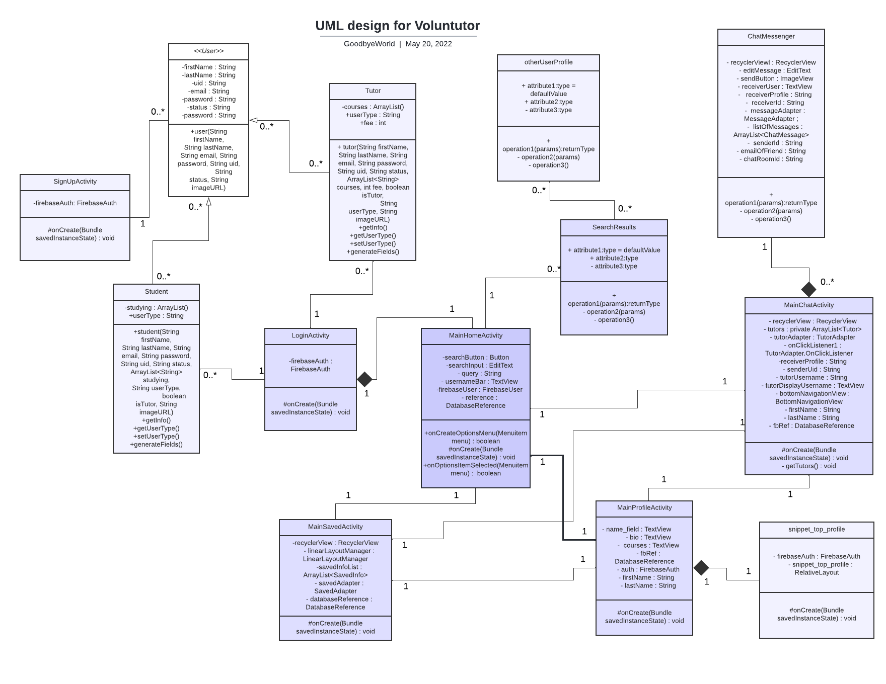

## 2.8 | Summary of Known Bugs
1. *Bug 1:* Navigation Bar
- The bottom Navigation Bar does not change colour of the selected screen you are on from the first click. 
- Work around if you double click it changes the icon to the correct displayed screen. 
- This is due to the XML files of the other main activities (saved, chat and profile) having home statically highlighted and does not display the correct symbol highlighted for the current page. Therefore the navigation bar only correctly changes on first tap from the `mainHomeActivity.java`

2. *Bug 2:* Harrison Rieck
- The name Harrison Rieck is shown on the chat home page despite not being the person you are actually talking to, as seen when you click on one of the profiles
- When searching for a tutor and their profile is clicked even though the clicked tutor displays the correct name the tutor profile displayed is always Harrison Rieck. 
- Therefore although the clicked tutor is not Harrison Rieck (even if Harrison Rieck isn’t a search result) it still shows the profile of Harrison Rieck. 
- We suspect this is caused by the class called in the `MainChatActivity.java` file, from lines 127 when it is getting the tutor name from the snapshot and checking if it matches any tutor names in the firebase.  
   - Through debug, we can see that the snapshot tutors array is correct and is getting all 8 of the tutors however when the tutor's array is passed down to the while loop (line 127) where it does not traverse all the tutor names and therefore only matches Harrison Rieck as he is the current tutor. 

3. *Bug 3*: Datastream
- The datastream sometimes does not retrieve the .csv file and will attempt to stream from an empty array. 
- Although the datastream is supposed to input the tutor side of the chat it sometimes won’t retrieve therefore the app crashes when clicking a chat when a user is signed in
- A potential reason for this bug is the fact that the CSV file is called in the “onCreate” class 
  - Another contributing factor could be that the CSV link is not dynamic therefore won’t work because the link does not change based on the user. 

4. *Bug 4*: Chat
- When a tutor chats with a student the chat won’t display as the adapter and methods are only getting tutors. 
- Fix around would be to add another adapter for students. Therefore when a tutor is signed in it would display students instead of tutors and therefore be able to access and chat 
- This is an error caused by the adapter and message classes taking in tutors from the firebase and not all users, this could be improved/fixed with more time. 

5.  *Bug 5*: Search
- The three features of search as mentioned previously are tutor, price, and course. However, there are some bugs with the features. 
- Partial queries work in specific cases. For example, searching for ‘Rohan’ with input ‘roh’ will produce the desired result as the partial query is in the beginning of the result. However, searching for ‘han’ will not produce ‘Rohan’ as ‘han’ is not the beginning for ‘Rohan’. 
  -  This is an issue with the myFind() method in the AVLTree class. We justified leaving this error as we decided that if a student was searching for ‘han’ they were intending to search for a tutor whose name begins with ‘han’ rather than ends with ‘han’.
- Misspelt queries do not work in situations where the query is not partially contained inside the desired result. For example, searching ‘rohhan’ will not give results for ‘rohan’, however searching ‘fin1001’ will give results for ‘finm’ courses because ‘fin’ is contained in ‘finm’.
- Searching for a price can result in other tutors which charge a greater price, but have the queried price contained within. For example, searching ‘10’ will give results for tutors who charge $10, but also tutors who charge $100 or $110, because ‘10’ is contained in all of those numbers. Similarly, searching ‘0’ will give results for every tutor with a ‘0’ in their price (e.g. 40, 50, 100, etc.). 
  - A fix for this issue is to create another find method inside the AVLTree class which does not check if a search is contained inside the value, but instead checks for exact equality. 
  - This method was created in the AVLTree class (called findFee(String fee)), however we did not have enough time to implement it in the SearchResults class and test the process. 
- Multiple tokens in one word do not get registered. For example, searching ‘COMP2100’ will show all results for ‘COMP’ - which is all tutors which teach COMP courses. 
Keywords $ and @ do not work in search. 
- Searching ‘$x’ where x is any number returns results for searching ‘0’. This is an issue within the Tokenizer class where it states to create an int token with value ‘0’ if there is no token after the ‘$’ symbol. 
  - Unfortunately, the numbers after ‘$’ are not registered as int tokens and the default is to treat it as ‘0’. 
- Similarly, searching ‘@x’ where x is any user does not return the desired result. However, this is a very rare case as it is likely that users will search for names directly instead of using ‘@’ keyword. 
Clicking on a search result goes on ‘Harrison Reick’s’ profile everytime, instead of the profile of the tutor you click on. 

6.  *Bug 6*: Edit Profile
- Although the data is sent to firebase the changed data does not display on the profile page
  -  This is due to a missing method in the class. To fix this a method the courses textview text needs to be set with the data in firebase. Similar to how the first name and last name has been acquired.
- Another bug with the edit profile is when tutors attempt to edit profile it crashes and takes the user back to the main home activity. 
  -  Solution: have a robust method that determines whether the current logged in user is a student or tutor. This can be implemented by accessing the parent node of the database and then traversing both child nodes (student and tutor) to see which node the currently logged in user’s UID belongs to. In MainProfileActivity lInes 48-65 implements the required method to fix this bug. 

7. *Bug 7*: Toast Messages
- There are numerous toast messages placed in the app although “.show()” has been called after each toast message for some devices/messages it does not show.
  - We suspect that a possible cause for this is due to the user's phone settings 

## 2.9 | Testing Summary
The testing done can be split into four sections white box, black box testing, debugging, and system out print. 

**White box testing**

For white box testing all our methods and code were run in the emulator. From the knowledge of knowing what the code was meant to do this could be tested. For example, the search function has three features, it can search by tutor, price, or course. Therefore we know that if a tutor's name is searched it should display the tutor's profile that matches the name searched. If a course is searched all tutors offering that course should show up as a result. Through this, we were able to find bugs that were covered in the previous section. 

Although we were not able to fix up the previous bug, this has been successful for other features. With the “android.app” functions such as “onCreate” or “onClick” white box testing was the most optimal choice for testing. From the code written within the method, we could see whether it was calling/executing the correct commands. E.g. with “onClick” for buttons if nothing happened we knew that there was an error in our method. 

**Black box testing:**

With black box testing we wrote TokeniserTests to ensure the Tokeniser and the Token classes were working. To achieve the most optimal tests for the Tokensier and Token classes another group member. The three tests written are testSimpleNameToken(), testSimpleCostToken(), and testException(). testSimpleNameToken() and testSimpleCostToken() both use assertEquals to test Although this only tests the simple cases we would have liked to do more boundary testing therefore we could be certain all cases in between work. Furthermore, the three tests written are solely for the tokenizer, therefore, tests for the AVL tree and parser are not covered. With more time tests for the AVL tree and parser should be written.  We acknowledge that our testing coverage is quite weak; implementing a rigorous boundary value analysis would have been beneficial. More is discussed in the improvements section of this report. 

Testing coverage is shown in diagram 17. 

Figure 14: testing coverage

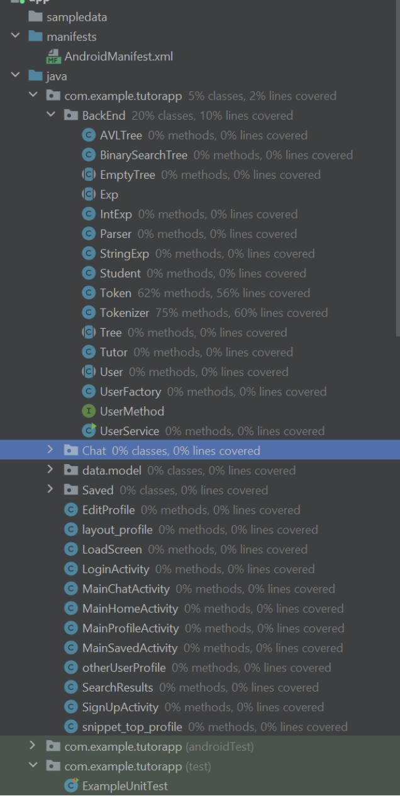

**Debug:**

Debug was used as a way to test without having to write test functions. Debug provides a way to locate the source of error within a class since we can strictly control when the next line of code is executed. It provides information on the properties of variables, assisting in the identification of locating any errors. For example, lots of the original code used "get" functions from the Student and Tutor files. We assumed these implementations would work, however it was only after running Debug it was discovered that none of the variables were instantiated; every time a "get" function was called it was attempting to retrieve an empty tutor/student object. 

**System Out Print:** 

Another way to test whether our code was working correctly is by printing out statements. As the print gets lost in the terminal hyphens are printed before and after the statement, we are after. This worked efficiently as debugging the app, would cause it to run very slowly, whereas printing out statements would run without lag. 

## 2.10 | Implemented Features

### 2.10.1 Basic App
 
1. **Login**
 
    Upon startup, the user is directed to the login page. A user can login with their details or sign up. All login information is stored in firebase. Login is only possible if a user is authenticated on firebase. Various toasts will appear such as if a user is not valid, if there is a network error etc. 
 
    **Classes and code:**
    - `LoginActivity.class`
    - `activity_login.xml`
 

2. **Loading information from Firebase**
 
    Our whole app implements this feature. All user information such as the details in the user profile and search results retrieves data from firebase  for the corresponding user and displays relevant information. 
 
    **Classes and code:** 
      -  `Saved.Package` (all 12 classes)
 
3. **Search**
    The search feature was implemented via an AVL tree as described in the **data structures** section above. Through the development of grammar, a tokenizer and a parser, the search allows a student to be able to find tutors by name or by the courses a tutor teaches. The search remains functional even if a user enters invalid or partially complete queries.
 
    **Classes and code:**
    - `AVLTree.class`
    - `BinarySearchTree.class`
    - `EmptyTree.class`
    - `Exp.class`
    - `IntExp.class`
    - `Parser.class`
    - `StringExp.class`
    - `Token.class`
    - `Tokenizer.class`
    - `Tree.class`
 
4. **Simulating a Data Stream**
    The data stream simulates a tutor sending messages to a stream. `Stream.csv` contains 3,528 instances (messages). As soon as the user enters the home activity, the simulation begins. The interval between messages is dependent on the execution speed of the implementation. 
 
    **Classes and Code:** 
    - `message.class`
    - `ReadStream.class`
    - `ReadStream.readActivityFromStream`

### 2.10.2 Additional Features 
6 easy 3 medium, 2 hard, 1 very hard 
 
1. **Improved Search** 

    **Search functionality can handle partially valid and invalid search queries (medium).** 
Partial queries work with a contains method within the myFind method of AVLTree class. Partial queries work for names and fees. For example, searching ‘Roh’ gives results for ‘Rohan’ and other tutors beginning with ‘Roh’. Invalid queries work in certain cases of misspelling. E.g. searching ‘FIN2002’ will give results for ‘FINM2002’ and other FINM courses. 
 
    **Classes and code**:
 
    - `AVLTree.class`
    - `BinarySearchTree.class`
    - `EmptyTree.class`
    - `Exp.class`
    - `IntExp.class`
    - `Parser.class`
    - `StringExp.class`
    - `Token.class`
    - `Tokenizer.class`
    - `Tree.class`
 
2. **UI Design and Testing** 
 
    **UI must have portrait and landscape layout variants as well as support for different screen sizes.(easy)** Therefore when the user rotates their phone or if they have a different screen size the ui has different layout variants. 
 
    **Classes and code**: 
    - `res.values.dimens.package`
 
3. **Greater Data Usage: Handling and Sophistication**

    **Read data instances from multiple local files in different formats (easy)** The app also takes data in from the data stream which calls data from a CSV file.  

    **Classes and code:**
    - `Assets`
 
4. **User Interactivity**
    **The ability to ‘follow’ users (medium)** When viewing a tutors profile users can click the button `saved` 
 
	**Classes and code:**
   - `MainSavedActivity.class `
 
 
4. **Privacy:**

    **User can only see a profile/event that is public (easy)**
In our app, users can only search for and view profiles of tutors. The profiles and information for students are not accessible by anyone. 

    **Classes and code:**
    - `Assets`

    **profile containing a media file (easy)** Users have profile images displayed in the profile and can view tutor profiles.

    **Classes and code:**

    - `ic_baseline_profile_icon.xml`
    - `ic_activity_status_circle.xml`

 
5. **Creating Processes**

    **Process visualisation. App implements graphical element to visualise the progress of loading the home activity. (easy)** After users log in or sign up a short 3 second loading screen is displayed before displaying the home page
 
    **Classes and code:**
		
    - `activity_load_screen.xml`
    - `LoadScreen.class` 

 
6. **Peer to Peer Messaging**

    **Peer to Peer Messaging (hard)** This feature was implemented through the use of ArrayAdapter and other complementary methods. A student has the ability to message a tutor, however the opposite is intentionally impossible as it is not a relevant feature. Conversations are stored on firebase under the node “Messages”, which is the first child node of the parent node of the firebase. This allows conversation history to appear without storing anything locally. 

    Provide users with the ability to message each other or an institution directly (hard)
 
    Messages are also stored in firebase. 
 
    **Classes and code:**
		
    - `Chat.package `
    - `MainChatActivity.class`
    - `data.model.Message.class`
    - `activity_chat_messenger.xml`
 
    **Provide users with the ability to restrict who can message them by some association (hard)** Users that are of the students class have the ability to only message users of the tutor class.. The association rules which restrict messaging interactions can be described as a one way mapping from students to tutors only. That is,  students cannot message other students and tutors cannot message other tutors. 

    **Classes and code:**
		
    - `Chat.package `
    - `MainChatActivity.class`
    - `data.model.Message.class`
    - `activity_chat_messenger.xml`

7. **Firebase Integration** 
 
    **User Firebase to implement user Authentication/Authorisation (easy)** When users create a profile that data is sent to firebase, therefore when the user returns to login the inputted information is authenticated.
 
    **Classes and code:** 
    - `LoginActivity.class `
 
 
    **Use Firebase to persist all data used in your app (medium)** All user data, chat data is stored in firebase. 
 
    **Classes and Code**: 
 
    Used in all classes  where information is presented  besides the compulsory data stream from the `steam.csv` file. 
 
    **Using Firebase or another remote database to store user information and having the app updated as the remote database is updated without restarting the application. (very hard)**
 
    This feature is implemented for the search feature. However, it will work for any additional feature which uses firebase. If a logged in student searches for a tutor, and while they are on the search activity a new tutor creates an account, the student will be able to search and find that tutor without restarting the app. Furthermore, if existing tutors make changes to their profile on the app, this change is instantly reflected in the search results when other users search (without other users having to close and reopen the app).
 
    **Classes and Code**    
    - `SearchResults.class `

## 2.11 | Surprise Item

**1. Lazy Class** 

This smell was identified in a commit of the `Tutor.class`

This class , at the time of this commit only contains a single constructor which does nothing else. 

This was a commit done on the 6th of may. The SHA is 6c624a1d.

**2. Excessive Comments** 

This smell was identified in a commit of the  `Tutor.java` class. 

A comment explaining an integer object was made. This is deemed trivial as the name of the object should have even set such that it conveys enough about its purpose. 

The commit was done on the 6th of may. The SHA is 117c1c40.
The excessive comment can be seen on line 6. The comment “hourly rate” would not be required if the object "fee" on line 7 was named "hourlyFee". 

**3. More Excessive Comments** 

This smell was identified in a commit of the `UserService.java` class.

A comment is made on line 9 identifying a constructor when it is obvious. Lines 32 -34 include propositions for implementations which are trivial as it is not labeled as TODO, FIXME etc. 

The commit was done on the 6th of may. The SHA is 117c1c40. 

**4. More Excessive Comments** 

This smell was identified in a commit of the `HomeFragment.java` class

It was committed on the 6th of may. The SHA is fbecb302. 

None of the code smells were fixed. This was largely due to the time constraint.

## 2.12 | Improvements  
 
We talk about general improvements that could be made. Since we have discussed the technical aspects in great detail, this section focuses, but is not limited to the group work aspect. 
 
Overall, communication was the main factor that must be improved. This is so that each member completes work that will not overlap or contradict with another member. 
 
The delegation of tasks was also another issue. Our initial approach resembled one where each member independently completed an aspect of the application. This was unwise as even a singular aspect is quite difficult to implement to a high standard. All tasks should be worked on together as much as possible. 
 
Further improvements and reflections can be read in each group member’s individual reflection submitted to wattle separately to this report. 

# 3 Teamwork 
## 3.1 | Summary of Individual Contributions

 **U7298781, Rohan Khatwani.**

I contributed 25% of the code. Here are my contributions:
- `BackEnd.package` (All 16 classes in the package)
- `SearchResults.class`
- `otherUserProfile.class: onCreate()`
 
 **Code Design:** 
I proposed the factory design pattern for the constructors for our app users. The user can be either a Tutor or a Student based on whether a checkbox is ticked upon sign up (boolean value). As such, the user factory can generate the relevant user (tutor or student) based on the boolean value. I also proposed the AVL Tree data structure to hold the relevant information from our app (Tutor name and information, course name and relevant tutor information, and fee and relevant tutor information). 
 
**UI Design:** 
I proposed a new activity pop-up when searching a query and displaying the results in a list view. When clicking an item (result) in the list view, the user is taken to the profile of the tutor on that search result. 
 
**U7298641, Lydia Huang.** 
I contributed 25% of the code. Here are my contributions:
- `Chat.package` (4 classes in package, Sung helped with errors)
- `MainChatActivity.class`
- `MainHomeActivity.class` (partial)
- `otherUserProfile.class` (partial)
- `data.model.Message.class`
- `LoadScreen.class`
- `activity_chat_messenger.xml`
- `activity_load_screen.xml`
- `activity_main_chat.xml`
- `activity_search_results.xml`
- `activity_main_home.xml` 
- `activity_chat_item_right.xml` (based on Emilys)
- chat_user_profile.xml (based on Sung’s)
- activity_other_profile.xml (based on Sung’s)
 
**Code Design:**
For the code design I input my opinion when needed as my main focus was the front end. 
 
**UI Design:** 
For UI design Emily and I came up with the navigation bar, colour theme, and creating each activity, home, saved, profile and chat. Additionally, the colour theme chosen is colour blind friendly. Furthermore, I created a custom logo for our app. 
 
**Miscellaneous:** 
Mediated conflicts and called meetings/study groups when needed. Contributed significantly to the report. 
 
**U7122524, Emily Nguyen.** 
I contributed 25% of the code. Here are my contributions:
- `LoginActivity.class `
- `SignUpActivity.class` lines 36-56, 76-93,99-128,155-166, 177-187, 193-196; other lines by Sung
- `MainSavedActivity.class`
- `SavedAdapter.class`
- `SavedInfo.class`
- `SavedRecyclerInterface`
- `TokenizerTest`
- `Activity_login.xml`
- `Activity_main_saved`
- `Activity_sign_up.xml` with modifications by sung
- `Saved_profile`
- `bottomNavigationView` switching to different on click 

**Code Design:**
I input my opinions when needed as my main focus was on the front end.

**UI DESIGN**
I along with Lydia came up with the navigation bar,colour themes and created each activity - home, saved, profile and chat. 

**miscellaneous**
I was responsible for the slides. For the report, I wrote the data structures of ArrayList and HashMap
 
**U6677355, Sung Lee.** 
I contributed 25% of the code. Here are my contributions:
- `Message.class` (using methods created by Lydia) 
- `ReadStream.class`
- `EditProfile.class`
- `activity_edit_profile`
- `stream.csv`
- `activity_profile.xml`
- `snippet_top_profile.xml`
- `layout_profile.xml`
- `MainProfileActivity.class`
- `Layout_profile.class`
- Firebase Architecture and implementation within classes. 
- Significant contribution to `SignUpActivity.class`
 
**Code Design:** 
I proposed the node structure of our real-time firebase database and the methods by which we can query information. I designed the backend of how the information would be processed such that it displays in the front end according to our design intentions. 
I actively voiced my opinion when asked regarding code choices. 
 
**UI Design:** 
I proposed aspects that the profile should have such as the edit button, and placement of elements such as the profile picture. I helped contribute to the design of the saved activity. I actively voiced my opinion when asked regarding design choices. 
 
**Miscellaneous contributions:** 
Proposed the implemented report structure alternative to the one provided. 
Significant contributions to report writing.
Mediated conflicts between group members. 

## 3.2 | Conflict Resolution Protocol
A conflict resolution protocol was discussed among the group members upon beginning the group project. This is outlined below:

**Issue: Disagree on which feature to implement**
Brainstorm pros and cons for each feature, consider if it is possible to add both features. If not, take a vote on which feature to implement. If vote is tied then pick the feature from the criteria: relevance in app, difficulty, ability to complete the feature to a high quality,

**Issue: Disagree on which way to implement a specific feature**
Pick the implementation based on relevance to the app, least amount of data duplication (if applicable), difficulty and ability to complete the feature to a high quality.

**Issue: Not getting along with group members**
Stay professional and treat members with respect. Only discuss assignment related topics and focus on the assigned tasks.

**Issue: Not being able to finish a task on time**
Make sure to inform the group and seek help from other members when you realise that you can not complete your task in time.

In general all group members are required to communicate their progress through the assignment and keep the group informed with what they are working on and how they are implementing certain tasks. This is to avoid conflicts with other features and code or data duplication.

## 3.3 | Team Meetings
- [Team Meeting 1](./Meetings/Meeting1.md)
- [Team Meeting 2](./Meetings/Meeting2.md)
- [Team Meeting 3](./Meetings/Meeting3.md)
- [Team Meeting 4](./Meetings/meeting4.md)

